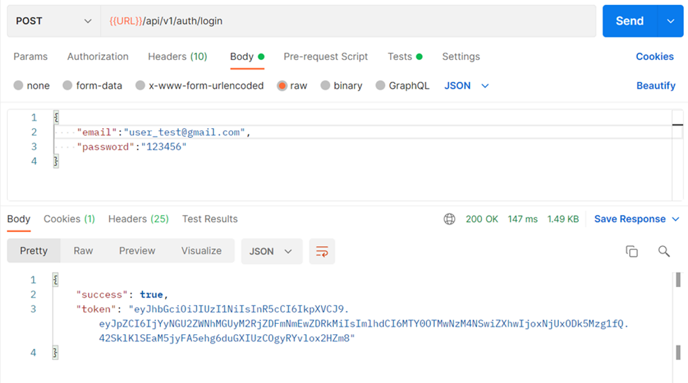
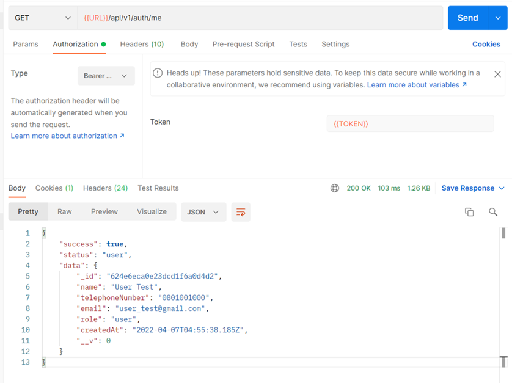
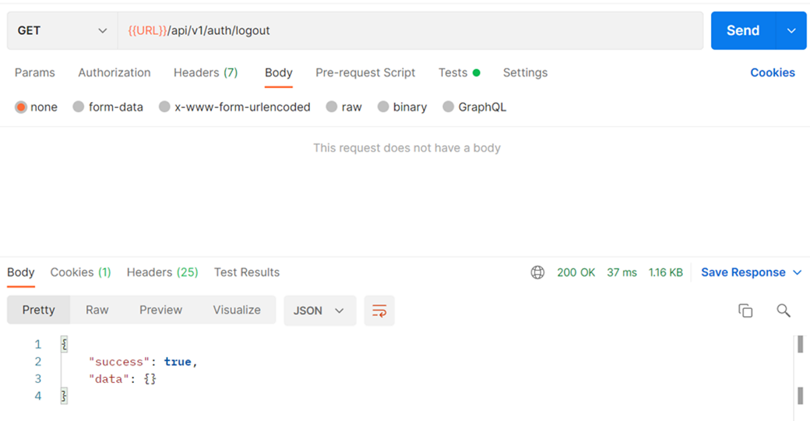
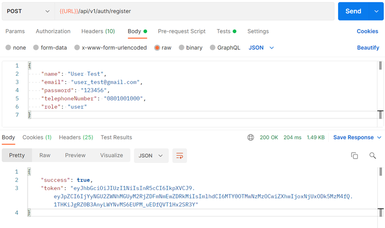

# Online Job Fair Registration

## Developers

- Julanan Jiwanantaprawat [@jjulanan](https://github.com/jjulanan/)
- Wisaroot Lertthaweedech [@wisarootl](https://github.com/wisarootl)

## Brief Description

Demo backend project for online job fair booking. This project is an assignment of Software Development Practice Class (2110503) at department of Computer Engineering, Chulalongkorn University.

## Table of Contents

- Problem Statement
  - Scope
  - Functional Requirements
  - Non-Functional Requirements
  - Constraints
- Digrams
  - ER Diagram
  - Class Diagram
  - [Sequence Diagrams](#sequence-diagrams) : [`Auth`](#auth), [`Booking`](#booking), [`Company`](#company)
- [Demo: Functional Requirements Verification](#demo-functional-requirements-verification)
  - [Testing as User](#testing-as-user) : [`Auth`](#auth-1), [`Booking`](#booking-1), [`Company`](#company-1)
  - [Testing as Admin](#testing-as-admin) : [`Auth`](#auth-2), [`Booking`](#booking-2), [`Company`](#company-2)
- Demo: Basic Security Testing
- Conclusion
- Developer's contribution

## Problem Statment

### Scope

### Functional Requirements

| Description                                                                                                                                                                                                                                                                                                                         |                Completed                |
| :---------------------------------------------------------------------------------------------------------------------------------------------------------------------------------------------------------------------------------------------------------------------------------------------------------------------------------- | :-------------------------------------: |
| 1. The system shall allow a user to register by specifying the name, telephone number, email, and password.                                                                                                                                                                                                                         |           [✅](#test-user-01)           |
| 2. After registration, the user becomes a registered user, and the system shall allow the user to log in to use the system by specifying the email and password. The system shall allow a registered user to log out.                                                                                                               | [✅](#test-user-02) [✅](#test-user-04) |
| 3. After login, the system shall allow the registered user to book up to 3 interview sessions by specifying the date (during May 10th-13th, 2022) and the preferred companies. The company list is also provided to the user. A company information includes the company name, address, website, description, and telephone number. |                                         |
| 4. The system shall allow the registered user to view his interview session bookings.                                                                                                                                                                                                                                               |                                         |
| 5. The system shall allow the registered user to edit his interview session bookings.                                                                                                                                                                                                                                               |                                         |
| 6. The system shall allow the registered user to delete his interview session bookings.                                                                                                                                                                                                                                             |                                         |
| 7. The system shall allow the admin to view any interview session bookings.                                                                                                                                                                                                                                                         |                                         |
| 8. The system shall allow the admin to edit any interview session bookings.                                                                                                                                                                                                                                                         |                                         |
| 9. The system shall allow the admin to delete any interview session bookings.                                                                                                                                                                                                                                                       |                                         |
| 10. The system shall allow the admin to create/update/delete company. (addition from requirement in assignment)                                                                                                                                                                                                                     |                                         |

### Non-Functional Requirements

### Constraints

## Diagrams

### ER Diagram

[full size image](./doc_asset/diagrams/er_diagram.svg)

### Class Diagram

[full size image](./doc_asset/diagrams/class_diagram.svg)

### Sequence Diagrams

#### Auth

- Get Me

  

  [full size image](./doc_asset/diagrams/squence_diagrams/auth/get_me.svg)

- Login

  

  [full size image](./doc_asset/diagrams/squence_diagrams/auth/get_me.svg)

- Logout

  

  [full size image](./doc_asset/diagrams/squence_diagrams/auth/get_me.svg)

- Register

  

  [full size image](./doc_asset/diagrams/squence_diagrams/auth/get_me.svg)

#### Booking

#### Company

## Demo: Functional Requirements Verification

### Testing as User

#### Auth

1. Register
   - [Satisfied requirement #1](#functional-requirements)

2. Login
   - [Satisfied requirement #2](#functional-requirements)

3. Get Me : after login

4. Logout
   - [Satisfied requirement #2](#functional-requirements)

#### Booking

#### Company

### Testing as Admin

#### Auth

#### Booking

#### Company

## Demo: Basic Security Testing

## Conclusion : Significant Change from VacQ project

## Developer's Contribution

<!-- ## Function testing with Postman

### Testing as user

#### Auth

#### Company

#### Booking

### Testing as admin

#### Auth -->
